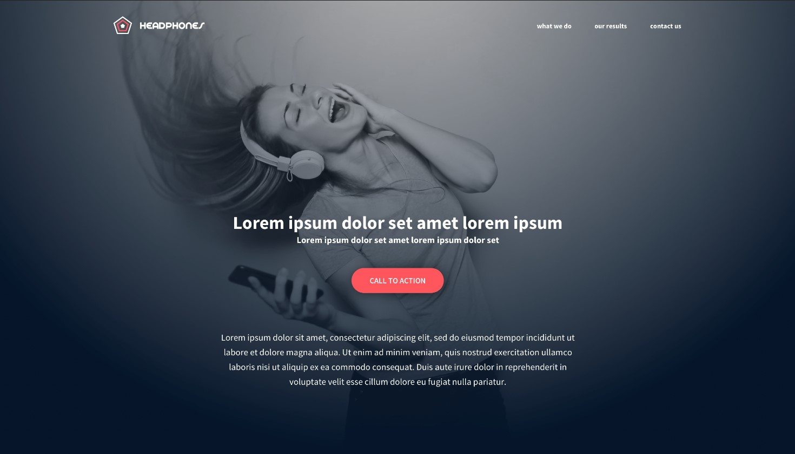

# alu-headphones

> Implementing a design from scratch

## Description
In this project, I'm implementing from scratch, without any library, a web page. Using all HTML/CSS/Accessibility/Responsive design knowledge that I learned previously.

NOTE: Instructions, you are free to implement it the way that you want - the objective is simple: Have a fully functional web page that looks the same as the designer file.
Here the final result:

> Initial design by Nicholas Philippot, UI/UX designer.
